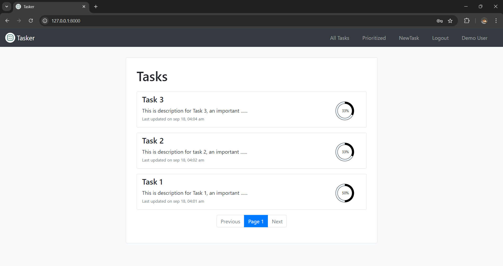
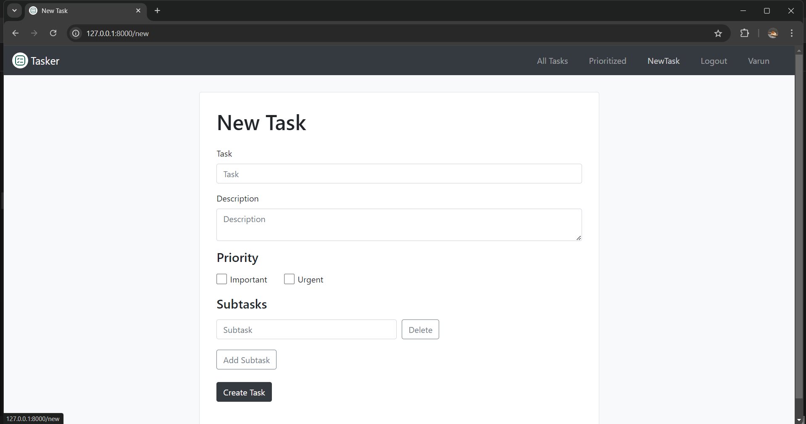
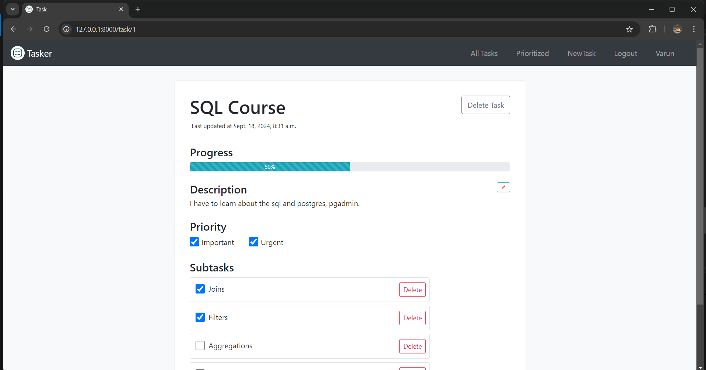
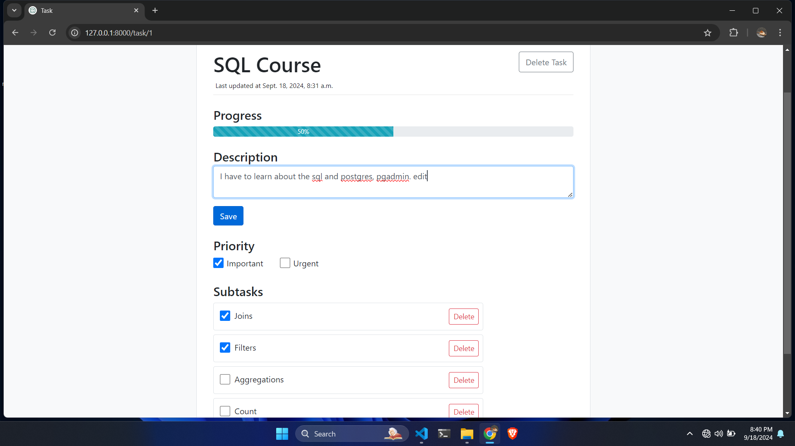
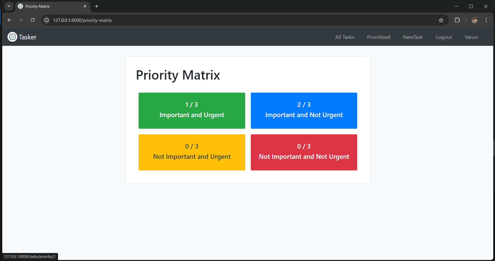
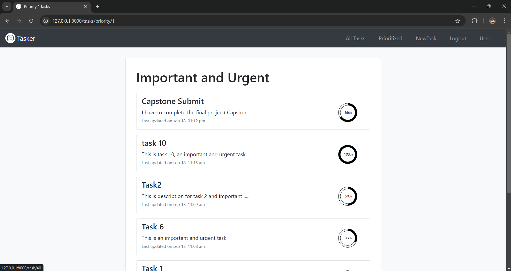
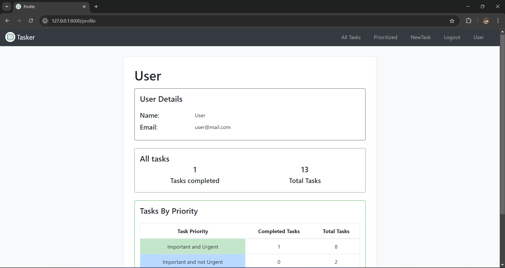
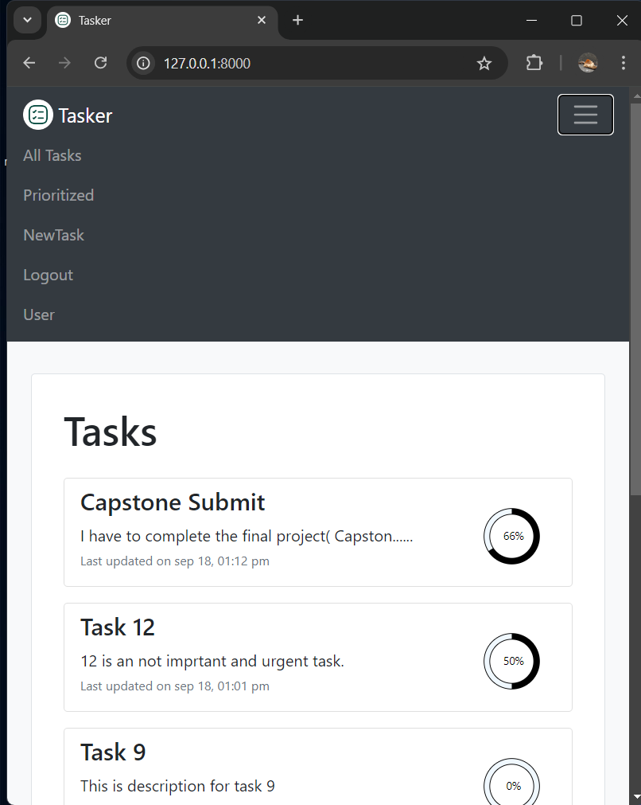

# CS50w Capstone (📝 Tasker)

This project is a task management app called "Tasker". This app is distinct from other task management apps out there. I created this because i wanted an app that can prioritize my tasks and shows the progress of each task i'm currently doing. This app mainly simplifies these two things.

Firstly, with this app you can create a task which is composed of subtasks hence, breaking down a large task into small and doable chunks. secondly, you can categorize and prioritize these tasks you created based on their importance and urgency. This application is also mobile responsive.

🎥 **Demo Video**: [Capstone Project Demo](https://youtu.be/tPgiXyVhU0U)



## ⚙️ Distinctiveness and Complexity

### 👉 Distinctiveness

This project is sufficiently distinct from all the other projects in the course. Because of the following reasons:

*Firstly*, this is a task management app. Hence, the concept itself is totally different from the commerce,network or wiki projects in this course. *Secondly*, the features of this app such as tasks, subtasks, prioritization, dynamic form fields for adding subtasks etc. are also totally different from the features of any previous projects . *Finally*, this project uses mostly asynchrous js to do things rather than doint things mostly statically as in previous projects.

### 👉 Complexity

This project surely, is more complex than those other projects in the course mainly due to the high amount of javascript used for changing things dynamically on a page.

For Example, in the new task form, users can add multiple subtasks dynamically. Initially form should display one subtask field with an "Add" button to insert more subtasks and a "Delete" button beside each subtask field to remove it. A task must have at least one subtask, alerting user if only one subtask field is present and user tries to delete it. I have to write high amount of javascript to handle these things.

Also the new task form submission should be handled asynchronously to account for the dynamic addition of subtask fields and On the the show task page where contents of a task are shown and the user can edit the contents of a task without reloading the page. I've written extensive JavaScript to manage API calls for task creation and to update the page content like updating the description, progress in progress bar, etc without refreshing.

Task list pages, like the index and priority pages, should display each task with a preview of its title, description, updated time, and a circular progress bar. The progress bar size should vary based on the number of subtasks completed for each task. Hence task boxes and progress bars should be dynamically rendered using JavaScript, with API fetch calls to load task data.

Coming to backend of this project it has models for user, task and subtasks with various methods for each model.

## 📂 File Contents

### 👉 Static files

- *`styles.css`* - contains the css styling for whole app.

- *`index.js`* - for showing tasks on index page along with their circular progress bars and pagination for those tasks

- *`show_priority_tasks.js`* - contains code very similar to index.js but for showing tasks with specific priority on the priority tasks pages.

- *`show_task.js`* - contains js code for fetch calls to api's when various parts of task such as Task description, priority, subtasks are edited.

- *`new_task.js`* - contains code for dynamically adding the additional subtask fields and asynchronously submitting the new task form.

### 👉 Html templates

- *`layout.html`* - template contains layout containing navbar for all the other templates in this app.

- *`index.html`* - index/home page template for showing all tasks of currently logged in user.

- *`register.html`* - this template contains the form for new user registration.

- *`login.html`* - this template contains the form for user login.

- *`new_task.html`* - this templates contains form for creating new tasks.

- *`priority_matrix.html`* - this templates shows the priority matrix page.

- *`profile.html`* - this template shows the profile page of user logged in.

- *`show_task.html`* - this template is used to show the contents of a task.

- *`show_priority_tasks.html`* - this templates shows the list of taks with specified priority.

### 👉 Views.py

This file contains various html template views and API views for the app.

### 👉 Models.py

This file contains the classes for following database models:

- User Model
- Task Model (with serializing methods for api views)
- Subtask Model (with serializing method for api views)

## ▶️ How to run the app

### Download the Project Code

- Clone the repo

```bash
  git clone https://github.com/me50/varunpenumudi.git
```

- Go into the repository folder

```bash
  cd varunpenumudi
```

- Switch to the project branch.

```bash
  git checkout web50/projects/2020/x/capstone
```

### Migrate and Run App

- Run the this command to migrate the models.

```bash
  python manage.py migrate
```

- Apply those migrations to database.

```bash
  python manage.py makemigrations
```

- Start the server to run the app

```bash
  python manage.py runserver
```

## 📱Features of app

Here are the features of the app along with some screenshots of it:

- New task can be added by clicking to NewTask link on navbar and filling, submitting the new task form.



- Previews of all your tasks on the index page showing the title, description and a circular progress bar for each task along with pagination for tasks.


- Contents of a task will be shown when clicked on it's preiview. All the task properties are shown when you click it.



- You can edit the description of a task, change it's priority, add/delete subtasks, check/uncheck a subtask which changes the progress bar dynamically.



- By clicking on the prioritize link in the navbar you can see the priority matrix for your tasks which shows how many tasks for each of 4 priorities.



- Clicking on one of the priority boxes takes you to the page showing the task previews of tasks having that priority.



- Clicking on the User Profile link in the nav bar takes you to the page showing details of user along with some statistics of tasks done by user.



- App is mobile responsive


